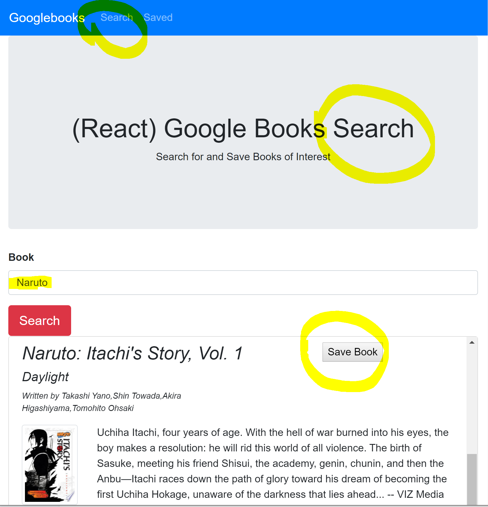
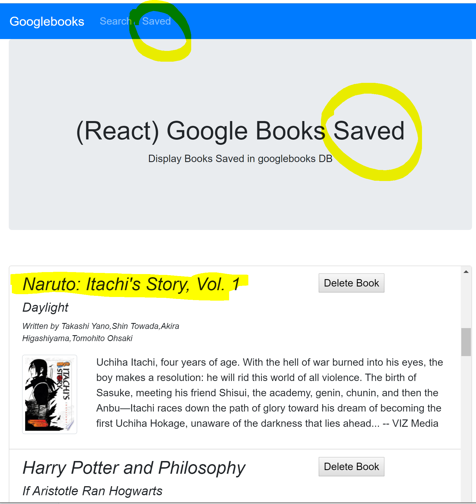
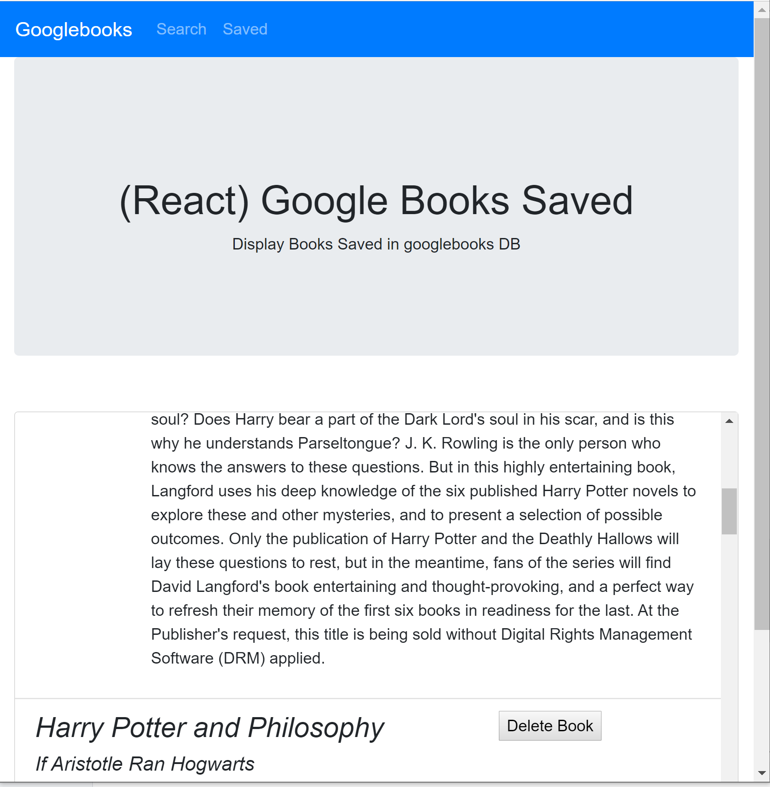

# Google Books Search
---
# Overview:
## This application uses Google Books API to search for books. You can store the books in the search page. Then you can view the books in the saved page.

[Link to App](https://googleb00ks.herokuapp.com/)
--- 
# How it works:

*   The app has 2 pages :
    * One is [Search](Search.png) - User can search for books via the Google Books API & Render them here. 

    

    * Then the user can "Save" a book, saving it to the database.

    * The Second is [Saved](Saved.png) - Renders all books saved to the database. 
    
    

    * The user can "Delete" a book, removing it from the database.

    
    
    * In MongoDB there is a database named `googlebooks` and a Book schema using mongoose.

    * Books have the following fields:
    * `title` - Title of the book from the Google Books API
    * `authors` - The books's author(s) as returned from the Google Books API
    * `description` - The book's description as returned from the Google Books API
    * `image` - The Book's thumbnail image as returned from the Google Books API
    * `link` - The Book's information link as returned from the Google Books API

    * [`react-router-dom`](https://github.com/reactjs/react-router) to navigate, hide and show your React components without changing the route within Express.

    * Express routes:

    * `/api/books` (get) - Returns all saved books as JSON.

    * `/api/books` (post) - Used to save a new book to the database.

    * `/api/books/:id` (delete) - Used to delete a book from the database.

